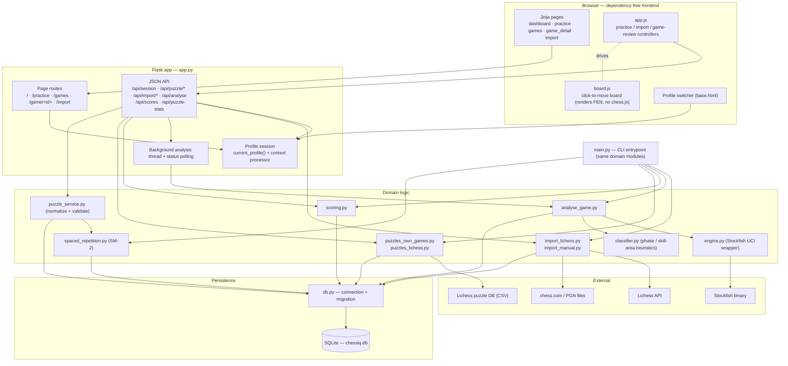
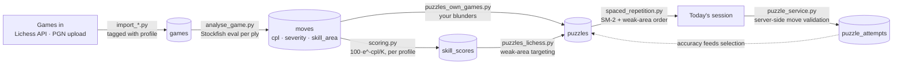
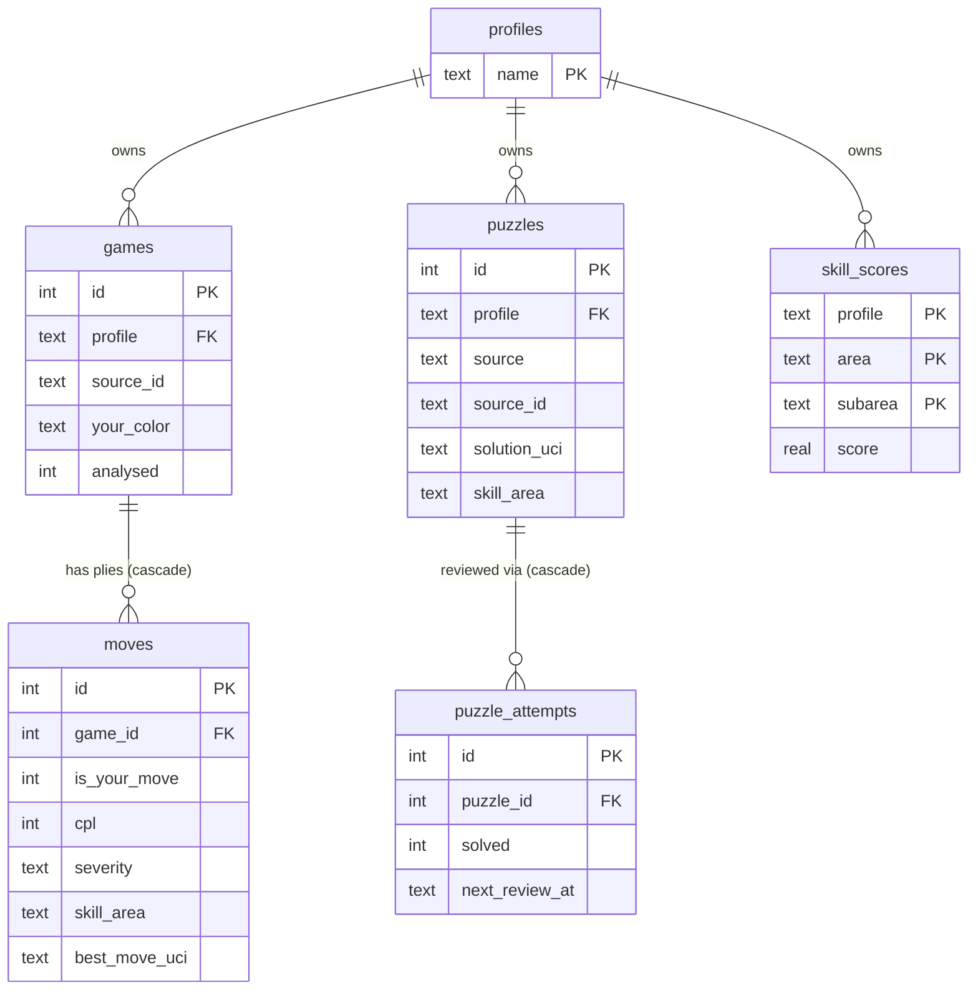

# chessIQ — Architecture

chessIQ is a **local, profile-scoped chess-improvement app**: it imports your games, runs
them through Stockfish, scores your skills, and turns your mistakes (plus targeted Lichess
puzzles) into a spaced-repetition practice queue. It runs two entrypoints — a **Flask web
app** (`app.py`) and a **CLI** (`main.py`) — over the same domain modules and a single
SQLite database. All chess logic lives server-side in `python-chess`; the browser board is a
dependency-free renderer (no CDN, no chess.js), so everything works fully offline.

The three diagrams below give a component view, the data pipeline, and the database schema.

## 1 — Component / layer view

Browser frontend talks to the Flask app; the Flask app and the CLI share the same domain
logic, which persists through `db.py` to SQLite and reaches out to external services
(Stockfish, Lichess, PGN files).

## 2 — Data pipeline

The weekly loop: import → analyse → score → generate puzzles → practice. Each stage writes a
table the next stage reads; puzzle accuracy feeds back into what surfaces next.

## 3 — Database (profile-scoped)

Seven tables. A **profile** (your username) owns games, puzzles, and scores; moves cascade
from games and attempts cascade from puzzles.

## Notes

- **Server owns the chess logic.** Move legality and puzzle-solution checking run in
  `python-chess` on the server (`puzzle_service.py`); `static/js/board.js` only draws the
  board from a FEN and reports clicked squares — no CDN, no chess.js, no piece images.
- **Everything is profile-scoped.** Games, scores, puzzles, and the practice queue all filter
  by the selected profile. `db.py`'s idempotent migration backfills legacy rows and rebuilds
  the `puzzles` table with a `(profile, source, source_id)` uniqueness key, so the same game
  can be tracked independently under two profiles.
- **Two entrypoints, one core.** `app.py` (web) and `main.py` (CLI) are thin shells over the
  same domain modules, so the analysis/scoring/puzzle logic is shared.
- **`skill_score_history`** (not drawn above) is the 7th table — append-only, capturing
  score snapshots per profile for future trend charts.
